# 游漫社官方网站开发过程文档

| 项目 | 内容 |
| --- | --- |
| 项目名称 | 游漫社官方网站 |
| 代码仓库 | https://github.com/WanderSouthern/youman-club |
| 演示站点 | http://129.204.36.49/ |
| 小组 | 第 10 组（4 人） |
| 成员 | 杨存溥（组长）、何宗昊、霍宇轩、郑孔桥 |
| 文档日期 | 2026年9月30日 |

---

## 1 项目概述

本项目为福建师范大学旗山校区游戏协会（游漫社）官方网站。一套代码同时覆盖桌面浏览器、移动端 H5 与 PWA，不另行开发原生应用。系统承担对外展示与对内社务两项目标：访客可了解社团、部门、活动与招新信息；经审批的社员可完成报名、现场签到、资料查阅与站内消息；工作人员可在管理端完成成员审批、活动运营与内容配置。

系统已具备可运行的公开站、社员区与管理端，并预留 QQ 机器人 Webhook 联动能力。

## 2 技术选型

| 层次 | 选型 | 说明 |
| --- | --- | --- |
| 应用框架 | Nuxt 3 + Vue 3 + TypeScript | 全栈单应用，页面与接口同仓维护 |
| 数据访问 | Prisma + SQLite | 便于在学生云主机一体化部署 |
| 身份认证 | 自建学号密码 + 会话 Cookie | 不对接学校统一身份认证 |
| 现场签到 | 动态二维码（qrcode）+ 口令 | 二维码校验参数定时刷新 |
| 安装形态 | PWA（@vite-pwa/nuxt） | 可添加到主屏幕，不上架应用商店 |
| 版本控制 | Git + GitHub | 远程仓库见上文链接 |
| 运行环境 | Node.js 18+，Nginx 反代 | 演示环境部署于云主机 |

## 3 版本控制说明

1. 使用 Git 进行源代码管理，主分支为 `main`。
2. 远程仓库托管于 GitHub：https://github.com/WanderSouthern/youman-club 。
3. 仓库已纳入 `.gitignore`，不提交 `node_modules`、`.env`、数据库文件与上传目录，避免密钥与运行时数据进入版本库。
4. 提交记录反映项目从初始化到生产环境 Cookie 与部署适配的演进过程。后续文档、界面截图与需求规格随版本一并归档。

本地初始化与运行：

```bash
npm install
npx prisma db push
npx tsx prisma/seed.ts
npm run dev
```

浏览器访问 `http://localhost:3000`。

## 4 开发过程

### 4.1 阶段划分

| 阶段 | 主要工作 | 结果 |
| --- | --- | --- |
| 立项与需求 | 明确对外门面与对内工作台双重目标，确定角色、栏目与活动闭环 | 形成策划口径与需求规格 |
| 公开站骨架 | 首页、关于、部门、活动、招新、登录注册与响应式布局 | 访客可完整浏览社团信息 |
| 账号与权限 | 注册默认待审核、会话、社员区与管理端路由守卫 | 内部功能与公开浏览分离 |
| 活动闭环 | 发布、报名、口令签到、动态二维码、评论点赞、名单导出 | 活动从发到收到可运营 |
| 社员协作 | 工作台、站内消息、资料库可见范围、个人资料 | 社员日常使用路径打通 |
| 管理端 | 成员审批、部门配置、站点内容、一言、招新意向、审计 | 工作人员可独立维护内容 |
| 部署与版本 | 云主机部署、Cookie 在 HTTP 环境下的可用性、GitHub 托管 | 公网可访问，代码可追溯 |
| 文档与截图 | 需求规格、开发过程、界面截图与小组小结 | 满足本阶段提交要求 |

### 4.2 已完成的主要功能

1. **公开门户**：首页品牌展示、部门入口、近期活动、关于社团、招新意向登记、PWA 安装说明。
2. **账号体系**：学号密码注册与登录；待审核限制；工作人员审批；账号停用；关键操作审计。
3. **活动运营**：活动/通知发布，报名与取消，口令签到与动态二维码签到，评论与点赞，开始/结束/取消的站内通知，名单导出，向报名者群发。
4. **资料与消息**：文件四级可见范围（公开 / 全社 / 本部门 / 管理级），社员私信与未读提示。
5. **管理配置**：部门增删改、站点文案、一言、招新意向查阅、机器人 Webhook 地址与密钥。
6. **联动预留**：注册待审、招新登记、活动取消时可向已配置的 Webhook 推送 JSON，供 QQ 机器人转发。

### 4.3 开发中的处理要点

1. 部门、活动、文件均挂接部门实体，新增部门由管理端完成，无需改导航结构。
2. 签到要求先报名；动态二维码带一次性校验参数并过期刷新，降低截图转发长期有效的风险。
3. 机器人未配置或推送失败时，注册、招新、取消活动等主流程仍正常完成。
4. 生产环境在备案前使用 HTTP 访问时，需正确设置会话 Cookie 的 Secure 属性，否则登录态无法保存。

## 5 界面截图

下列截图取自当前可运行系统（公开页取自演示站点，登录后页面取自本地完整数据环境）。

### 5.1 首页

公开首页展示社团名称、一言、部门入口与近期活动。

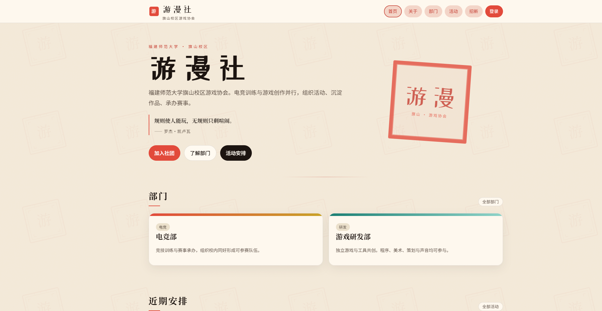

### 5.2 关于社团

简介、沿革、组织与联系方式。

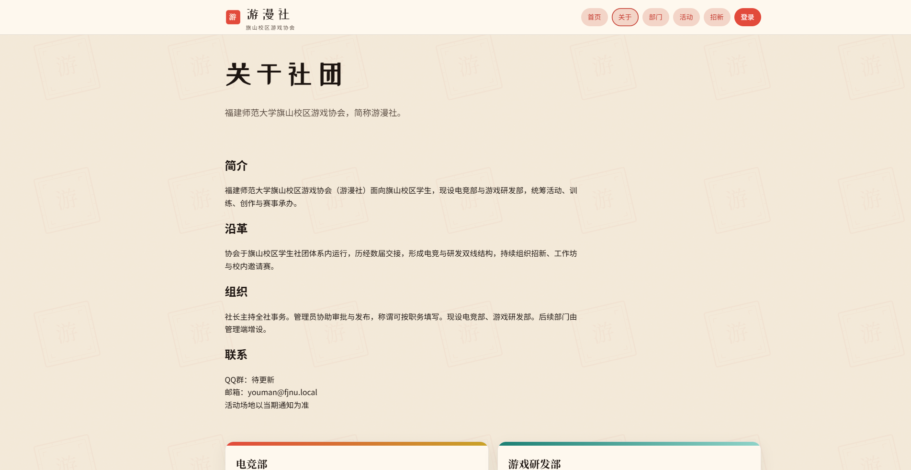

### 5.3 部门列表

已发布部门以卡片展示，点击进入详情。

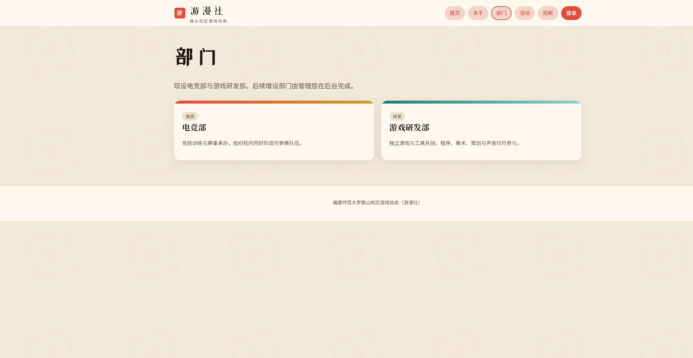

### 5.4 活动列表

支持按活动/通知筛选与关键词搜索，展示地点与报名人数。

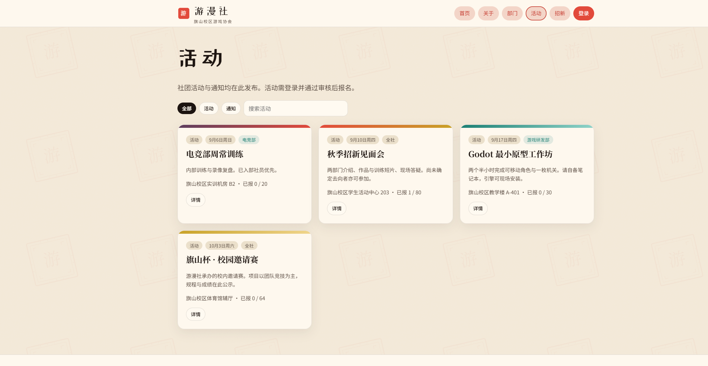

### 5.5 招新登记

访客填写意向表，提交后不自动开户，由管理层审核。

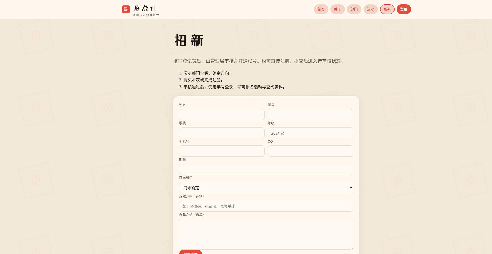

### 5.6 登录

使用学号与密码登录；新账号须审核后方可使用内部功能。

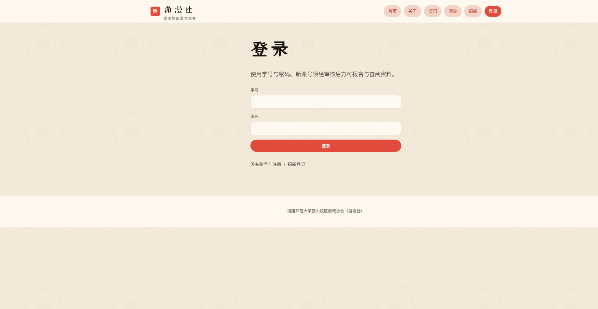

### 5.7 社员工作台

登录后可查看报名与签到统计、进入资料与管理入口。

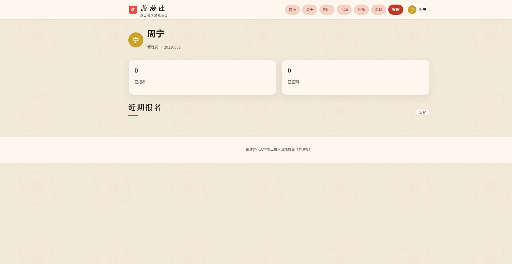

### 5.8 管理端总览

成员、活动、招新意向计数及近期审计记录。

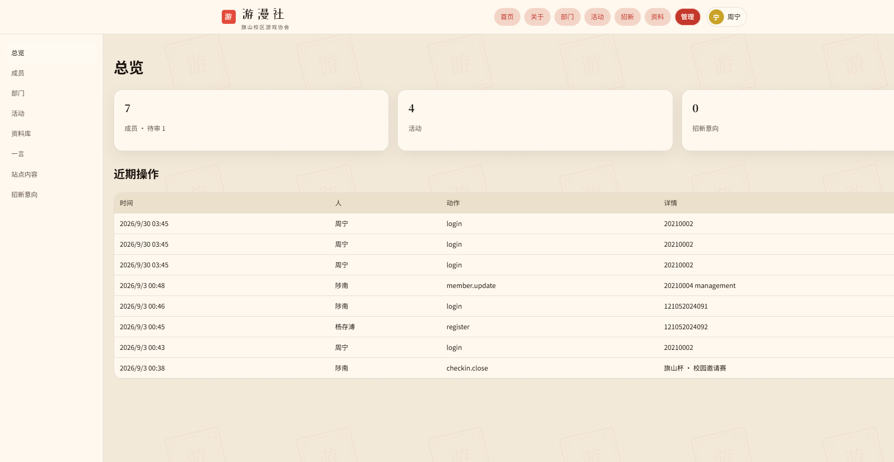

### 5.9 成员管理

按身份、状态、部门筛选，可进入档案完成审批。

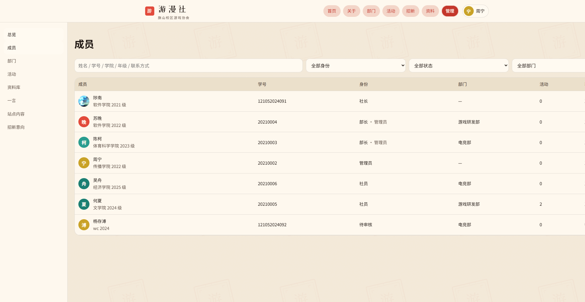

### 5.10 活动管理

工作人员可发布活动或通知，并维护已有活动。

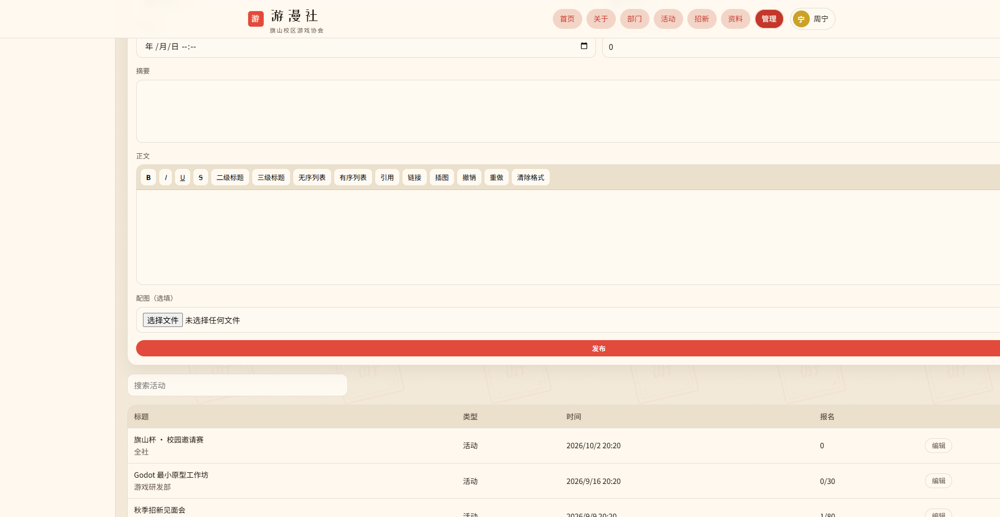

### 5.11 资料库

按分类与可见范围检索，支持上传、下载与删除（权限范围内）。

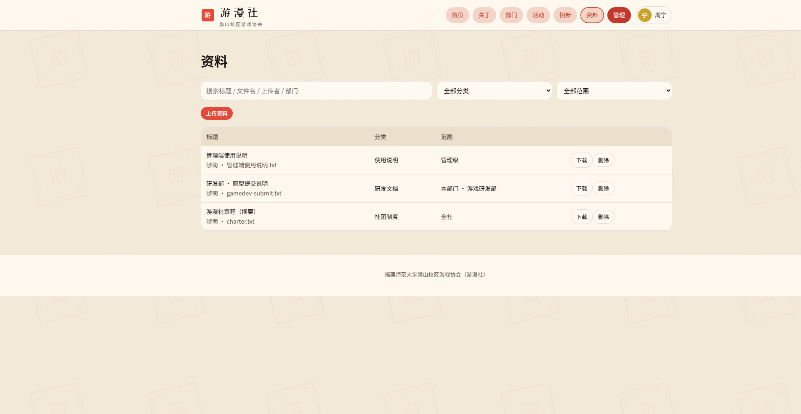

## 6 小组分工与完成情况

| 成员 | 职责 | 完成情况 |
| --- | --- | --- |
| 杨存溥（组长） | 项目统筹、版本仓库、账号权限、管理端配置、QQ 机器人 Webhook、云主机部署与文档统稿 | 已完成：GitHub 托管、会话与权限、站点配置、演示环境上线、需求规格与本过程文档统稿 |
| 霍宇轩 | 公开门户：首页、关于、部门、招新、PWA 与公开页验收 | 已完成：公开栏目可浏览，招新表单可提交，安装说明可用 |
| 何宗昊 | 活动全流程：发布、报名、签到、评论点赞、站内通知、群发与名单导出 | 已完成：活动列表与详情、报名签到闭环、管理端活动运营 |
| 郑孔桥 | 社员工作台、资料库可见性、成员档案与一言、接口与权限核对 | 已完成：工作台、资料库、成员列表与档案、文件分级可见 |

模块交叉部分由组长协调：招新提交、注册待审与活动取消触发的机器人出站通知，由事件源模块配合、组长负责报文与配置。

## 7 个人工作小结

### 7.1 杨存溥

本人作为组长，负责需求口径统一、GitHub 仓库维护和云主机部署，保证小组有同一套可运行代码。实现上主要承担账号注册登录与会话、角色权限（访客 / 待审核 / 社员 / 管理层 / 社长）、管理端总览与站点配置，以及 QQ 机器人 Webhook 的出站推送与失败隔离。部署阶段处理了 HTTP 环境下登录 Cookie 无法保存的问题。本阶段已完成代码集上传准备、界面截图归档和开发过程文档统稿。后续将继续推进机器人指令查询的联调，以及域名与 HTTPS 配置。

### 7.2 霍宇轩

本人负责公开门户。完成首页首屏与部门、活动入口，关于社团的简介、沿革、组织与联系，部门列表与详情，招新流程说明与意向登记表，以及 PWA 安装说明（含微信内置浏览器与 iOS Safari 的提示）。公开页已在演示站点核验，布局适配桌面与移动端。招新登记与注册开户分离，避免未审核访客直接进入内部功能。后续需配合将招新开关在页面侧真正生效，并替换占位联系方式。

### 7.3 何宗昊

本人负责活动与通知模块。完成活动发布与编辑、公开列表筛选、社员报名与取消、现场口令签到与动态二维码签到、评论与点赞，以及活动开始、结束、取消时的站内通知和向报名者群发、名单导出。签到与报名绑定，未报名不能签到；二维码校验参数定时刷新。管理端可开关签到并查看报名情况。后续需补齐签到高峰时的并发核验，并完善取消活动后的列表展示状态。

### 7.4 郑孔桥

本人负责社员日常使用与权限相关页面。完成工作台统计、我的活动、站内私信与未读、个人资料与头像，以及资料库的分类检索和四级可见范围（公开、全社、本部门、管理级）。管理端侧配合完成成员列表筛选、档案查阅和一言的启用停用。已核验越权用户不能下载管理级文件。后续将继续做接口失败路径与权限负面用例的核对，并协助文件容量与备份策略落地。

## 8 小组后续要解决的问题

1. **QQ 机器人双向联动尚未闭环**：当前已实现网站向 Webhook 推送待审、招新、活动取消事件；机器人侧按指令查询待审名单、招新意向并回复 QQ 会话的能力仍需完成联调与验收。
2. **自助找回密码未开通**：成员忘记密码时，目前由工作人员在档案中重置，缺少邮箱验证码自助找回。
3. **正式域名与 HTTPS**：演示环境仍使用公网 IP 与 HTTP，待学校二级域名核发并完成证书配置后，再调整会话安全属性。
4. **招新开关与文案占位**：管理端虽可配置招新相关项，对外联系方式、QQ 群等仍有占位内容，需在上线前替换为正式口径。
5. **赛事深度功能不做本期范围，但需说明边界**：旗山杯等赛事以活动形式公示，不包含自动对阵与比分录入；若后续承办需要，应单列迭代。
6. **PWA 在微信内的限制**：微信内置浏览器无法可靠添加到主屏幕，需在招新摊位和说明页持续提示改用系统浏览器。
7. **备份与容量**：学生云主机磁盘有限，需落实数据库与上传目录的定期备份，并继续限制大文件与视频直存。
8. **测试用例与回归**：需求编号已冻结，后续应按模块补齐功能、接口、权限与机器人相关测试用例并执行回归。

## 9 提交物清单

| 序号 | 内容 | 位置 |
| --- | --- | --- |
| 1 | 项目源代码 | GitHub 仓库 `main` 分支 |
| 2 | 界面截图 | `docs/screenshots/` |
| 3 | 开发过程文档（本文） | `docs/开发过程文档.md` |
| 4 | 软件需求规格说明书 | `docs/软件需求规格说明书.md` |
| 5 | 演示站点 | http://129.204.36.49/ |

---

（正文结束）
